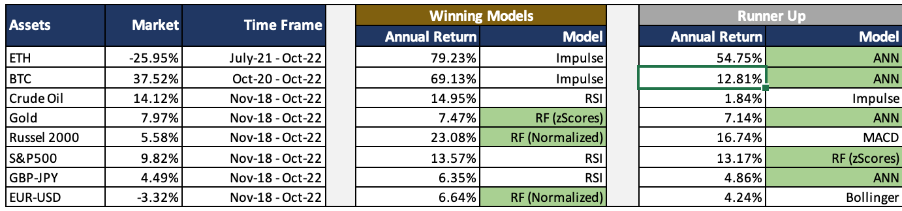

# **Arrow-Up Capital**

 **UTOR: FinTech Bootcamp - Project 2: Algorithmic Trading Strategies and Machine Learning Models**
=======

 

## **Research Question**

Investigate whether a Random Forest Model or Artificial Neural Network can perform better than established Technical Analysis trading strategies across asset classes.

 

---
## **Abstract**

Algorithmic trading has traditionally used various statistical and technical indicators along with established trading rules to identify opportunities in the market. Our goal was to investigate whether a Random Forest (machine learning) model or an Artificial Neural Network could use these same indicators to come up with better trading rules than the more established ones. In addition, our research was extended to multiple asset classes which included Stocks, Commodities, Foreign Exchange and Crypto Currencies. 

Interestingly, our research produced mixed results. For the cyrpto asset class, the technical strategies saw better returns with the weaker performance for the machine learning models in this asset category mainly being attributed to the smaller training period used in the analysis. In contrast for the remaining asset classes which had more richer and more data available, saw the machine learning and ANN models produce much more healthier and comparable reults to that of the traditional strategies.

As such, we find that although there is no clear winner between the differnt systems, it is evident that each trading strategy can be enhanced by incorporating elements of other. Traditional Strategies can be improved by incorporating probability metrics produced by the machine models and likewise the machine learning and ANN models can be extended to included risk limits (such as stop/loss limits). 

It is hoped that further research can be done on this which may lead to more satisfactory results.

 

---
## **Background**

 

    

 

Technical indicators, such as MACD, RSI, etc. are heavily used with traditional trading systems. These are rule-based, where the technique is "compute some indicators, then see what happens later." These systems begin with the rules. The critical values at which action takes place are coded into the trading system model.

Trading systems based on machine learning begin with the data and let the model-fitting process identify patterns in the data that precede profitable trades. These systems begin with the signals or trades you want to identify. The technique is "identify desirable trades, then see what happened earlier."

Research done by Arrow-Up Capital invested the impact of each trading system and compared the strategies across four asset classes, namely: stocks, commodities, forex and crypto currencies. Results of our findings are presented below:

 

---
## **Collaborators**

- [Aizhen Dong](https://github.com/JD-Yue)
- [Abuzar Fakhruddin](https://github.com/AbuzarF)
- [Chris Ringwood](https://github.com/KristopherGit)
- [Saibal Saha](https://github.com/saibal-saha)
- [Desi Reddy](https://github.com/Rebel1124)

 

---
## **Technologies Used**

1. Python
2. Pandas
3. Numpy
4. Plotly
5. Yahoo Finance API
6. Streamlit
7. Sklearn
8. Jupyter Notebook
9. Keras
10. Pandas-TA

 

---
## **Asset Classes**

### **Stock Indices - Russel2000 and S&P500**

The S&P 500 index is an equity index comprised of approximately 500 large-capitalization companies. The Russell 2000 index is a stock market index comprised of approximately 2,000 small-capitalization companies. Both the S&P 500 and the Russell 2000 index are market cap- weighted.

 

### **Commodities - Oil and Gold**

Gold, like every other commodity, is subject to seasonal changes. Demand for gold is driven mainly by the jewelry industry. Gold prices usually spike up during the September through December period as jewelers stock up in gold prior to the year-end holiday shopping season.
 
Oil is abundant and in great demand, making its price primarily a function of market forces. Many variables affect oil prices, including the basic economic theory of supply and demand. The law of supply and demand states that if supply increases, prices will go down.

 

### **Foreign Exchange - EUR/USD and GBP/JPY**
The US Dollar and the Euro are two of the most prominent and well-known currencies in the world. The Euro versus US Dollar (EUR/USD) currency pair has the largest global trading volume, meaning it is the world's most-traded currency pair. 

The GBP/JPY pairing is viewed as a reliable indicator of global economic health. These individual currencies provide a strong reflection of economic health and policymaking in both the Asia-Pacific region as well as Western Europe.

 

### **Crypto - BTC and Ethereum**

Ethereum is a technology that's home to digital money, global payments, and applications. At its core, Ethereum is a decentralized global software platform powered by blockchain technology. Bitcoin is an innovative payment network and a new kind of money. Additionally, Bitcoin is also a decentralized digital currency that can be transferred on the peer-to-peer bitcoin network. Cryptocurrencies that are not pegged to a real-world asset or currency are subject to market volatility.

 

---
## **Machine Learning and Artificial Neural Network**

### **Machine Learning**

Machine learning (ML) is a type of artificial intelligence (AI) that allows software applications to become more accurate at predicting outcomes without being explicitly programmed to do so. Machine learning algorithms use historical data as input to predict new output values.

 

### **Random Forest Model**

A random forest is a supervised machine learning algorithm that is constructed from decision tree algorithms. The random forest lgorithm consists of many decision trees. The 'forest' generated by the random forest algorithm is trained through bagging or bootstrap aggregating. in essence, bagging is an ensemble malgorithm that improves the accuracy of machine learning algorithms by taking the mean of the average of the output produced from various decision trees.

 

### **Artificial Neural Network**

It is neurally implemented mathematical model. It contains huge number of interconnected processing elements called neurons to do all operations. Information stored in the neurons are basically the weighted linkage of neurons.

 

---
## **Technical Indicators**

### **Simple Moving Average (SMA)**

The most used type of moving average is the simple moving average (SMA), sometimes referred to as an arithmetic moving average. An SMA is constructed by adding a set of data and then dividing by the number of observations in the period being examined.

 

### **Exponential Moving Average (EMA)**

An exponential moving average (EMA) is a type of moving average (MA) that places a greater weight and significance on the most recent data points. The exponential moving average is also referred to as the exponentially weighted moving average. An exponentially weighted moving average reacts more significantly to recent price changes than a simple moving average (SMA), which applies an equal weight to all observations in the period.

 

### **Rate of Change Index (ROC)**

The rate of change (ROC) is the speed at which a variable changes over a specific period of time. ROC is often used when speaking about momentum, and it can generally be expressed as a ratio between a change in one variable relative to a corresponding change in another; graphically, the rate of change is represented by the slope of a line.

 

### **Momentum Indicator (MOM)**

The Momentum indicator is a speed of movement indicator that is designed to identify the speed (or strength) of price movement. This indicator compares the current close price to the close price N bars ago and also displays a moving average of this difference.

 

---
## **Trading Strategies**

### **Moving Average Convergence/Divergence (MACD)**

Moving average convergence/divergence (MACD, or MAC-D) is a trend-following momentum indicator that shows the relationship between two exponential moving averages (EMAs) of a security’s price. The MACD line is calculated by subtracting the 26-period EMA from the 12-period EMA. The result of that calculation is the MACD line. A nine-day EMA of the MACD line is called the signal line, which is then plotted on top of the MACD line, which can function as a trigger for buy or sell signals. A buy signal when the MACD line crosses above the signal line and a sell or short is seignaled when the MACD line crosses below the signal line

 

### **Relative Strength Index (RSI)**

The relative strength index (RSI) is a momentum indicator used in technical analysis. RSI measures the speed and magnitude of a security's recent price changes to evaluate overvalued or undervalued conditions in the price of that security. The RSI is displayed as an oscillator (a line graph) on a scale of 0 to 100. Typically, an RSI reading of 80 or above indicates an overbought situation. A reading of 20 or below indicates an oversold condition.

 

### **Impulse System (Impulse)**

The Impulse System is based on three indicators, a 12-day EMA, a 26-day EMA and the MACD-Histogram. The moving average identifies the trend, while the MACD-Histogram measures momentum. As a result, the Impulse System combines trend following and momentum to identify impulses that can be traded on.

If both trend indicators are up and the MACD-Histogram is increasing, a buy signal is generated. Similarly, if both trend indicators are down and the MACD-Histogram is decreasing then a sell signal is generated.

 

### **Bollinger Bands (BB)**

A Bollinger Band is a technical analysis tool defined by a set of trendlines plotted two standard deviations (positively and negatively) away from a simple moving average (SMA) of a security's price. If the asset price crosses the upper bollinger band, a sell signal is generated. Similarly, if the securities prices crosses the lower bollinger band then a buy signal is generated.

 

---
## **Steps**

### **1. Data**

Asset data for our study was obtained from the Yahoo Finance API. According for our research, we obtained price data for the following asset classes and corresponding assets:

- Stock Indices - Russel2000 and S&P500
- Commodity - Oil and Gold
- Forex - EUR/USD and GBP/JPY
- Crypto -BTC and Ethereum

The research period for the assets were taken from 2006-06-30 to 2022-10-31, except for Bitcoin for which the earliest data obtained was from Dec-2014 and Ethereum which was from Jan-2018.

 

### **2. Data Cleaning and Technical Indicator Calculation**

Since all the data was pulled from the Yahoo Finance API, there was no data adjstments that needed to be made. Given this, we were able to pull the data as dataframe from the API and using the pandas-TA were able to calculate the required technical indicators for our research. The technical indicators calculatedalong with the lengths or settings for each indicator are shown below:

 

Daily Indicators:
- Daily EMA Short = 12
- Daily EMA Long = 26
- RSI Length = 14
- Momentum Length = 14
- ROC Length = 21
- SMA Length = 50
- Bollinger Bands Length = 30
- MACD Fast = 12
- MACD Slow = 26
- MACD Signal = 9

After calculating the required indicators, we further calculated the rolling z-Scores using a 30 day window as well as a normalised set of feature variables. The idea behind to apply the Standard Scaler model to the raw indicators before passing through the Random Forest Model. 

Similarly, we wanted to run the z-Scores features as well as the normalised features each through the Random Forest Model and compare these to the Technical Strategy and ANN results. For the normalised feature set, we applied the following rules:

- one-day indicator difference (indicator delta) -> 12Day EMA, 26Day EMA and 50Day SMA
- price / indicator -> upper BB, lower BB and middle BB
- indicator / ((rolling 2stdev)*100) -> RSI, MOM, ROC
- indicator / price -> 2stdev 
- idicator (unchanged) -> MACDline, MACDSignal and MACD-Histogram

In addition, the daily percentage change of the asset was calculated along with a signal (1 if positive daily return and -1 if negative daily return) with both 'Actual Returns" and 'Signal" columns shifted back one day. This was done to make the computations for the Trading strategies, ML and ANN returns easier as well as to prevent look-ahead bias. Accordingly a dataset for each asset was obtained (following the same steps above) to be used in our analysis.

 

### **3. Trading Strategy Returns**

Using the Techical Indicators calculated from step 2, we were then able to calculate the MACD, RSI, Impulse and Bollinger Bands returns (strategies and trade signals described above). In addition, since these strategies were more transparent and customizable, we were able to include a risk metric into the strategies. Accordingly, a stop/loss limit of 10% was set for each trade, meaning that if a long position was entered and the asset price fell by more than 10%, then the position was closed and converesely if a short position was enetered and the security price increased by 10% then this position was also closed. Thereafter, descriptive statistics and cumulative returns for each system was also calculated and compared to the assets Buy&Hold returns.

This was done for each of the considered securities and the results were then compared to the Random Forest and ANN models.

 

### **4. Random Forest (Classification) Model Returns**

Again using the dataset produced in step 2, we were able to run the Random Forest model for the raw indicators, rolling 30day zScore indicators as well as the normalised indicators as our feature variables. This 'signals' coulumn (calculated in step 2) was used as our target or y-variable. Consequently this produced three sets of results (raw indictors-transformed using standard scaler, zScores and Normalized). Similar to the Trading strategies in step 2, decriptive statistics and cumulative returns were calculated for each of these models (standard scaler, zScores and Normalized).

This was done for each security and the results were then compared to the technical trading srategies and ANN model.

 

### **5. Artificial Neural Network Returns**

Using the dataset for each asset class, we then ran the standard scaled raw indicators through the ANN model. Again the scaled indicators were used as our feature variables, however given the mechanics of the ANN model, the signals columns was transformed to 0 for sell and 1 for buy before being passed through the ANN model.

The architecture saw us use three hidden layers along with a regularization layer and a finally an output layer. For each of the hidden layers, we used 8 nodes with the activation function set to RELU. Similarly for the regularization layer, 14 nodes were used along with the RELU activation function as well as a 0.01 kernel_regulizer and 0.01 bias_regulizer.

For the final output layer, we applied one node with he activation function set to sigmoid.

This model was then run for each asset with same cumulative returns and descriptive statistics calculated and compared to the other systems described above.

 

---
## **Results**

 

Firstly, our results from the Random Forest models were interesting. Accuracy scores between the three models considered ranged from 0.46 to 0.54. Even more noteworthy though was the models accuracy and recall score for the buy and sell signals. 

Here we saw that some models performed better for buy signals than sell sgnals (zScore Model for S&P500), while for others it was the opposite (standard features for Gold). Interestingly there were even dramatic difference within an asset for pecision and recall scores as well (standard features - S&P500).

In all, we got mixed bu satisfactory results for our Random Forest models. More work can be done on this however by tuning the models hyperparameters it is envisaged that better model results can be obtained.

 

### **Random Forest Classifiction Report**

***(1) Stadard Scaler Features***

|     Asset  	     |  Buy Prec  |	 Buy Recall |  Sell prec |  Sell Recall	 |  Accuracy  |
|--------------------|------------|-------------|------------|---------------|------------|
|       Oil          |     0.55   |	   0.58     |    0.44    |     0.41      |	  0.51	  | 
|      Gold	         |     0.56   |	   0.24     |    0.45    |     0.77      |    0.48    |
|    Russel200       |	   0.55   |    0.43     |    0.49    |     0.61      |	  0.51    | 
|     S&P500         |	   0.55   |    0.04     |    0.46    |     0.96      |	  0.46    |
|     EUR/USD        |     0.52   |    0.50     |    0.52    |     0.54      |	  0.52    |      
|     GBP/JPY        |	   0.49   |    0.47     |    0.47    |     0.50      |	  0.48    |	     
|      BTC	         |     0.60   |    0.15     |    0.50    |     0.90      |	  0.51    |       
|      ETH           |	   0.49	  |    0.48	    |    0.51    |     0.51      |	  0.50    |

 

***(2) Rolling 30day zScore Features***

|     Asset  	     |  Buy Prec  |	 Buy Recall |  Sell prec |  Sell Recall	 |  Accuracy  |
|--------------------|------------|-------------|------------|---------------|------------|
|       Oil          |    0.58    |	    0.51    |    0.47    |      0.54     |	 0.52 	  | 
|      Gold	         |    0.55    |	    0.59    |    0.44    |      0.41	 |   0.51     |
|    Russel2000      |	  0.54    |     0.61    |    0.49    |      0.41     |	 0.52     | 
|     S&P500         |	  0.55    |     0.64    |    0.47    |      0.38     |	 0.52     | 
|     EUR/USD        |    0.52    |     0.50    |    0.51    |      0.53     |	 0.52     |       
|     GBP/JPY        |	  0.48    |     0.46    |    0.46    |      0.48     |	 0.47     |	      
|      BTC	         |    0.51    |     0.65    |    0.48    |      0.35     |	 0.50     |          
|      ETH           |	  0.50    |    	0.53    |    0.52    |      0.49     |	 0.51     |

 

***(3) Normalized Features***

|     Asset  	     |  Buy Prec  |	 Buy Recall |  Sell prec |  Sell Recall	 |  Accuracy  |
|--------------------|------------|-------------|------------|---------------|------------|
|       Oil          |     0.56   |	    0.56    |    0.45    |    0.45       |	  0.51	  | 
|      Gold	         |     0.55   |	    0.52    |    0.45    |    0.49	     |    0.50    |
|    Russel2000      |	   0.55   |	    0.67    |    0.52    |    0.39	     |    0.54    | 
|     S&P500         |	   0.53   |     0.37    |    0.45    |    0.61       |	  0.48    |
|     EUR/USD        |     0.51   |     0.58    |    0.51    |    0.43       |	  0.51    |            
|     GBP/JPY        |	   0.54   |     0.51    |    0.52    |    0.55       |	  0.53    |	     
|      BTC	         |     0.52   |     0.43    |    0.49    |    0.58       |	  0.50    |       
|      ETH           |	   0.47   |    	0.63    |    0.47    |    0.32       |	  0.47    |

 

Next for the Artificial Neural Network Model, we again received mixed results with accuracy scores between the training and test period ranging from 0,5 to 0.73, which in all accounts is a notable difference. In deed the biggest difference were observed for the crypto asset class (BTC and ETH) which we have attributed to the smaller training period window. 

The difference in accuracy scores between training and test periods for the other asset classes, were also notable but not as dramatic and although not ideal looked satisfactory. However, we strongly believe further research can b done on improving these models and reducing the difference between traing and test scores.

 

### **ANN Model Scores**

|     Asset  	     |  Training Acc  |	   Test Acc    | Training Loss  |   Test Loss	 |
|--------------------|----------------|----------------|----------------|----------------|
|       Oil          |     0.5890     |	    0.5000     |     0.6737     |     0.7624     |	     	  
|      Gold	         |     0.5865     |	    0.5202     |     0.6689     |     0.7090     |            
|    Russel2000      |	   0.5981     |     0.5046     |     0.6597     |     0.7989     |	  	      
|     S&P500         |	   0.5843     |	    0.5379     |     0.6737     |     0.7589     |            
|     EUR/USD        |     0.5960     |     0.5019     |     0.6661     | 	  0.7178     |            
|     GBP/JPY        |	   0.5772     |     0.5141     |     0.6733     |  	  0.7095     |            
|      BTC	         |     0.6023     |     0.5172     |     0.6605     |     0.9139     |		      
|      ETH           |	   0.7318     |    	0.5015     |     0.5842     |     1.3771     |	          

 

Finally we looked at the returns produced by the models for each asset and determined the winning and runner up strategies for our back testing period. Results are shown in the tables below. Interesting, our analysis shows that there is a more or less even split between the traditional and ML/ANN models in terms of the best and second strategies when looking at the strategy returns as well as Sharpe ratios's.

The ANN produced the highest return at 69.59% for ETH but was trumped by the Impulse system at 79.23%. It shoud be noted though that ETH had the smallest testing period due to limited data, nevertheless the results produced were notable.

For the Random forest, the normalized features produced the highest returns for the Russel2000 at 23.08%, which beat the MACD strategy at 16.74%.

In total 8 of the technical strategies had produced either winning returns or runner up returns and likewise we had 8 ML/ANN models producing the same resulting in a tie! (We found the exact same returns when accounting for volatility when we looked at the Sharpe ratio's). 

 

### **Best Strategies per Asset**

***(1) Asset Returns***

    

 

***(2) Asset Sharpe Ratios***

    

 

For detailed cumulative return graphs and descriptive statistics for each asset and for each of the Trading Strategies and Random Forest Models, please click on the link below. This is the streamlit application that we have built and deployed that alllows suers to not only see the results but to also interact with the models as well. Users can change various settings on the left sidebar and the app will recalculate the backtesting results - which we hope will make our study more dynamic and interactive.

<b>Note:</b> Please change settings (top right to wide mode) and end date to 31-October-2022 to get to the same results as our investigation.

**Click on link for detailed asset class analysis and statistics: [Asset Returns - Trading Strategy Analysis](https://rebel1124-algotrading-optimizer-algotrading-optimizer-ndyd3q.streamlit.app/)**

 

---
## **Conclusion**

Our study has indeed produced interesting results and although there was no clear winner between the technical strategies and ML/ANN models, we belive our research has set the foundation for further research in this topic.

In particular, we believe that the ML/ANN models can be enhanced by incorporating the probability of signals into the model. It is envisioned that by trading on high probability signals, the returns for these models can be enhanced.

In addition, we also believe that by setting risk limits, one can hopefully reduce the volatility of returns for the ML/ANN models and thereby increase the models Sharpe ratio.

The possibilities for further investigation is endless, and we truely hope that our sparks more interest and research in this field!

 

---
## **Postmortem**

### **(1) Artificial Neural Network Model**

We experienced the most difficulty with getting the ANN model to run correctly. Since we calculated buy and sell signals using +1 and -1 as our target/y-variable, the results we obtained were clearly incorrect and after much work, we eventually worked out that the signals had to be transformed into +1 for buy and 0 for sell before running it through the ANN model. Since the last layer used the sigmoid activation function, having signals with -1 somehow caused issues with model.

 

### **(2) Data Issues Model**

For our Trading Strategues, we initially looked at including weekly data as well, however after calculater indicators and using them in our systems we found that for many strategies they produced look-ahaed bias and so it was decided to drop the weekly data from our study and only work with daily prices and indicators.

Another issue that was picked up with the weekly data was that for the Open, High, Low, Volume numbers were the same for an extended period of time for the forex asset class, which produced unrealistic results for our strategies when back-testing. Again this motivated us to use only daily data in our research.

 

### **(3) Look-ahead Bias**

For many of our models, we seemed to be generating exponential returns which suggested the model had some look-ahead bias. Again after much discussion (and experimentation), we finally worked out that by moving the "Actual Returns" and 'Signals' back one day then we could use the features and signals (as is from the dataset) and by applying the models predictions to the 'Actual Returns" (that we shifted back one day), we were able to overcome our look-ahead bia issue.

 

---
## **Reference**

1. The New Trading For A Living - Author: Dr. Alexander Elder

2. https://tradewithpython.com/generating-buy-sell-signals-using-python

3. Pandas-TA Library - https://github.com/twopirllc/pandas-ta

4. Investopedia - https://www.investopedia.com/terms/e/ema.asp

5. Investopedia - https://www.investopedia.com/terms/r/rateofchange.asp

6. Investopedia - https://www.investopedia.com/terms/m/macd.asp

7. Investopedia - https://www.investopedia.com/terms/r/rsi.asp

8. Investopedia - https://www.investopedia.com/terms/b/bollingerbands.asp

9. Tradingview - https://www.tradingview.com/script/vv3r5BKm-MTM-Momentum-Indicator

10. Tradingview - https://www.tradingview.com/script/oCbEFfpg-Indicator-Elder-Impulse-System

